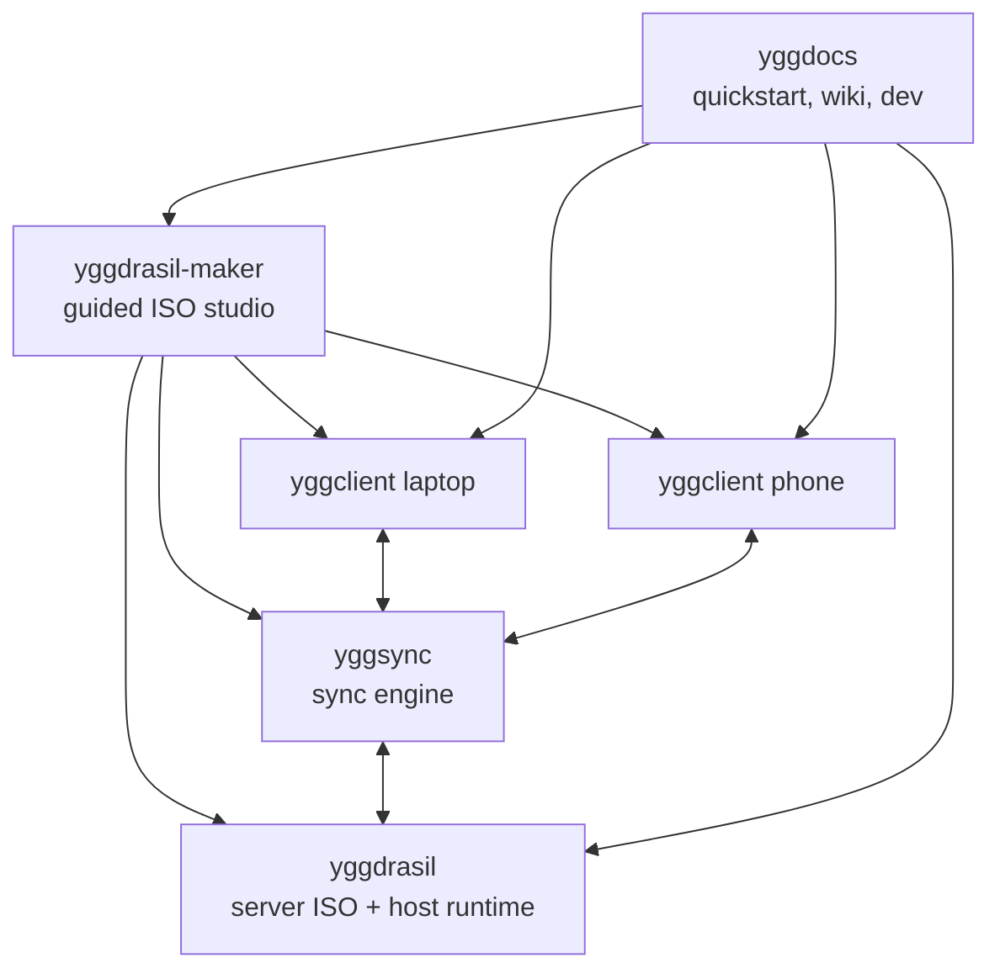

# yggdrasil

`yggdrasil` builds the host at the center of the Yggdrasil ecosystem.

It produces a Debian sid live ISO for the machine that becomes your storage spine, your LXC host, your recovery anchor, and often the quiet box in the corner that the rest of your setup eventually depends on.

This repository now carries both halves of that story:

- `yggdrasil-maker` is the guided front door for people who want a premium app and a native config they can keep
- `mkconfig.sh` remains the direct operator path for people who want to stay close to the shell truth

The public contract is simple:

- GUI first
- native config stays real
- Docker is an execution substrate, not the product
- the app's job ends when your custom ISO is ready and you know how to boot it
- long-form docs still belong in `yggdocs`

## The Ecosystem In One View

A simple mental model:

- `yggdrasil-maker` personalizes and builds the ISO
- `yggdrasil` contains the native build truth and host runtime wiring
- `yggclient` configures the machines you use every day
- `yggsync` moves data between them
- `yggdocs` is the manual, field guide, and operational memory

```text
                         +----------------------+
                         |       yggdocs        |
                         | quickstart, wiki, dev|
                         +----------+-----------+
                                    |
                                    v
 +-------------+           +--------+--------+           +-------------+
 |  yggclient  |<--------->|    yggsync      |<--------->|  yggclient  |
 |   laptop    |           | sync engine     |           |    phone    |
 +------+------+           +--------+--------+           +------+------+
        \                           |                           /
         \                          |                          /
          \                         v                         /
           +------------------------------------------------+
           |                  yggdrasil                     |
           | Debian sid ISO, ZFS, LXC, host runtime         |
           +-------------------------+----------------------+
                                     ^
                                     |
                               +-----------+
                               | maker app |
                               | GUI first |
                               +-----------+
```

Mermaid version:



## What A Yggdrasil Server Is

A Yggdrasil server is not just a generic Debian install.
It is the machine you prepare to do the heavy, patient work:

- import and mount your ZFS pool correctly
- bring up LXC with the expected defaults
- autostart the containers that matter
- remain bootable and understandable from a USB image
- give you a reproducible host baseline instead of an improvised snowflake

For many operators, this becomes the box that eventually holds:

- storage
- containers
- backup targets
- sync destinations
- reverse proxies
- service front doors

That is why the ISO matters.
It is not wallpaper.
It is the first disciplined step in the rest of the system.

## Who This Repo Is For

Use this repository directly if:

- you are comfortable editing config files
- you want full control over build inputs
- you want to script builds without waiting for the GUI
- you want to understand the host composition plainly

Use `yggdrasil-maker` if:

- you want sensible defaults first
- you want a guided personalization flow
- you are new to the ecosystem
- you want a premium ISO studio that still emits the native config file

The important design rule is this:

- `yggdrasil-maker` is the canonical guided path
- the native config files stay real and editable
- the path from beginner to operator stays open

## Repository Boundaries

- `yggdrasil`: ISO composition, hooks, package lists, host runtime wiring
- `yggdrasil-maker`: guided GUI plus a stable secondary automation CLI
- `yggclient`: endpoint automation for laptops, desktops, and Android/Termux
- `yggsync`: sync engine and job runner
- `yggdocs`: quickstart, wiki, recipes, and developer references

## Local Config

Use a local untracked config file.

- tracked example: `ygg.example.toml`
- tracked template preserving the old infrastructure shape: `ygg.legacy-infra.example.toml`
- local file: `ygg.local.toml` (gitignored)

`mkconfig.sh` accepts `--config` with either:

- TOML (`*.toml`)
- env files containing `YGG_*` key/value pairs

That means a power user can stay here permanently without `yggdrasil-maker`, while a new user can begin with the app and later continue by hand.

## Quick Start

### Guided path with `yggdrasil-maker`

Download the latest native build from GitHub Releases:

- Linux and macOS: `yggdrasil-maker-<platform>.tar.gz`
- Windows: `yggdrasil-maker-<platform>.zip`
- automation metadata: checksums plus `yggdrasil-maker-release-manifest.json`

The public rule is simple:

- native downloads are the main path
- the GUI is the canonical product
- `curl | sh` and `irm ... | iex` exist for automation and direct installs

Direct install for automation and power users:

```bash
curl -fsSL https://raw.githubusercontent.com/yggdrasilhq/yggdrasil/main/scripts/install.sh | sh
```

On Windows:

```powershell
irm https://raw.githubusercontent.com/yggdrasilhq/yggdrasil/main/scripts/install.ps1 | iex
```

The packaging scripts that generate the native release assets live in:

- [scripts/package-maker-platform-release.sh](/home/pi/gh/yggdrasil/scripts/package-maker-platform-release.sh)
- [scripts/package-maker-release-manifest.sh](/home/pi/gh/yggdrasil/scripts/package-maker-release-manifest.sh)
- [docs/yggdrasil-maker-distribution.md](/home/pi/gh/yggdrasil/docs/yggdrasil-maker-distribution.md)

The first foundation release exposes a stable automation-facing CLI while the GUI shell is being built. The build contract is already the intended one:

- `yggdrasil-maker` owns named setups, preset mapping, native config materialization, and Docker invocation planning
- the version-matched build container runs the existing shell truth
- non-Linux users stay on the honest export/handoff path until local-build support is proven

The current app shape is now:

- packaged native builds enable the first desktop shell by default
- the CLI remains available as the stable automation surface
- saved setups live in the app data directory and strip sensitive fields unless the user explicitly chooses to remember them
- Linux `build run` performs real Docker-backed local builds
- non-Linux `build run` produces an export bundle plus handoff manifest instead of pretending a local build happened

Example in-repo foundation flow:

```bash
cargo run --manifest-path yggdrasil-maker/Cargo.toml --bin yggdrasil-maker -- setup new --name "Lab NAS" --preset nas --output ./lab-nas.maker.json
cargo run --manifest-path yggdrasil-maker/Cargo.toml --bin yggdrasil-maker -- build plan --setup ./lab-nas.maker.json --authorized-keys-file ~/.ssh/authorized_keys --json
./scripts/build-maker-image.sh
cargo run --manifest-path yggdrasil-maker/Cargo.toml --bin yggdrasil-maker -- build run --setup ./lab-nas.maker.json --authorized-keys-file ~/.ssh/authorized_keys --repo-root "$(pwd)"
./scripts/package-maker-platform-release.sh linux-x86_64
./scripts/package-maker-release-manifest.sh
```

For desktop development right now, keep a sibling checkout of `~/gh/yggterm`. `yggdrasil-maker` reuses the in-flight `yggui` crates directly from that repo until the shared shell layer is split into its own portable home.

Sensitive paths are permission-gated by design, so the automation CLI accepts runtime flags such as `--authorized-keys-file` instead of silently persisting those values unless the user explicitly opts in later.

For GUI builds, packaging now compiles with the `desktop-ui` feature so the shipped `yggdrasil-maker` binary opens the native shell when launched without subcommands.

### Direct path with `mkconfig.sh`

If you want to work here directly:

```bash
cp ygg.example.toml ygg.local.toml
./mkconfig.sh --config ./ygg.local.toml --profile server
```

To build both server and KDE variants:

```bash
./mkconfig.sh --config ./ygg.local.toml --profile both
```

To skip smoke tests during iteration:

```bash
./mkconfig.sh --config ./ygg.local.toml --profile server --skip-smoke
```

## First Server Guidance

For a first Yggdrasil server, the recommended path is conservative:

1. set the host basics first
2. keep `apt_proxy_mode = "off"`
3. keep `infisical_boot_mode = "disabled"` unless you already run Infisical in an LXC
4. build and boot the host
5. validate ZFS import, LXC defaults, and container behavior
6. add an apt-proxy container later if you actually need faster rebuilds
7. switch later builds to explicit proxy mode
8. switch later builds to `infisical_boot_mode = "container"` only after you intentionally adopt that pattern

That sequence is deliberate.
The first success should be legible.
Speed comes after trust.

Kernel policy:

- `with_lts = false` uses Debian unstable's current kernel line
- `with_lts = true` switches to the compatibility-pinned kernel path
- that compatibility path is useful when a driver or DKMS stack needs a steadier ABI

## Examples

### 1. First server with defaults

```bash
cp ygg.example.toml ygg.local.toml
./mkconfig.sh --config ./ygg.local.toml --profile server
```

Use this when you want to produce the first ISO before tuning every dial.

The public default deliberately does not assume a secrets-management container on day one.
When you later want the boot path to ensure an Infisical LXC is up before dependent services, set:

```toml
infisical_boot_mode = "container"
infisical_container_name = "infisical"
```

Keep private hostnames, container names, proxy addresses, and SSH paths in your local untracked config only.

## Intel Arc SR-IOV Live Host

If you want the live host to expose Intel Arc virtual functions for KVM guests, use the opt-in SR-IOV path documented in:

- `docs/intel-arc-sriov-live-host.md`

By default, `yggdrasil` uses the stock in-kernel `i915` driver.

The SR-IOV path is intentionally opt-in and experimental. It bakes the out-of-tree `i915-sriov-dkms` driver into the ISO, adds the required kernel arguments, provisions VFs at boot, and can bind those VFs to `vfio-pci` for guest assignment.

Use the stock in-kernel `i915` path unless you are explicitly experimenting with Intel GPU SR-IOV or other unsupported Intel graphics virtualization work.

### 2. Automated server build with explicit overrides

```bash
yggcli --workspace ~/gh \
  --set yggdrasil.hostname=mewmew \
  --set yggdrasil.net_mode=dhcp \
  --set yggdrasil.static_dns="192.168.1.1 9.11.11.11" \
  --set yggdrasil.with_lts=false \
  --set yggdrasil.with_nvidia=false \
  --build-iso --profile server
```

Use this when a CI job, agent, or repeatable script is driving the build.

### 3. Direct build from a local TOML profile

```bash
./mkconfig.sh --config ./ygg.local.toml --profile server
./mkconfig.sh --config ./ygg.local.toml --profile kde
```

Use this when you want the server and desktop ISOs to stay separate and explicit.

## What The Build Produces

The normal output is a bootable live ISO that carries the host runtime choices baked into this repository:

- Debian sid userspace
- current Debian kernel line
- ZFS userspace and DKMS integration
- LXC defaults and autostart hooks
- optional KDE profile when requested
- optional SSH key embedding when configured

## Privacy And Public Hygiene

Do not commit:

- private hosts
- internal domains
- tokens
- secrets
- local-only infrastructure names

Use generalized examples in tracked files.
Keep your real values in `ygg.local.toml` and other gitignored local config files.

## Where To Read Next

- `yggdocs` for the real quickstart and recipes
- `yggcli` if you want the guided path
- `AGENTS.md` if you are working on build and ops automation in this repo

## License

Apache-2.0
