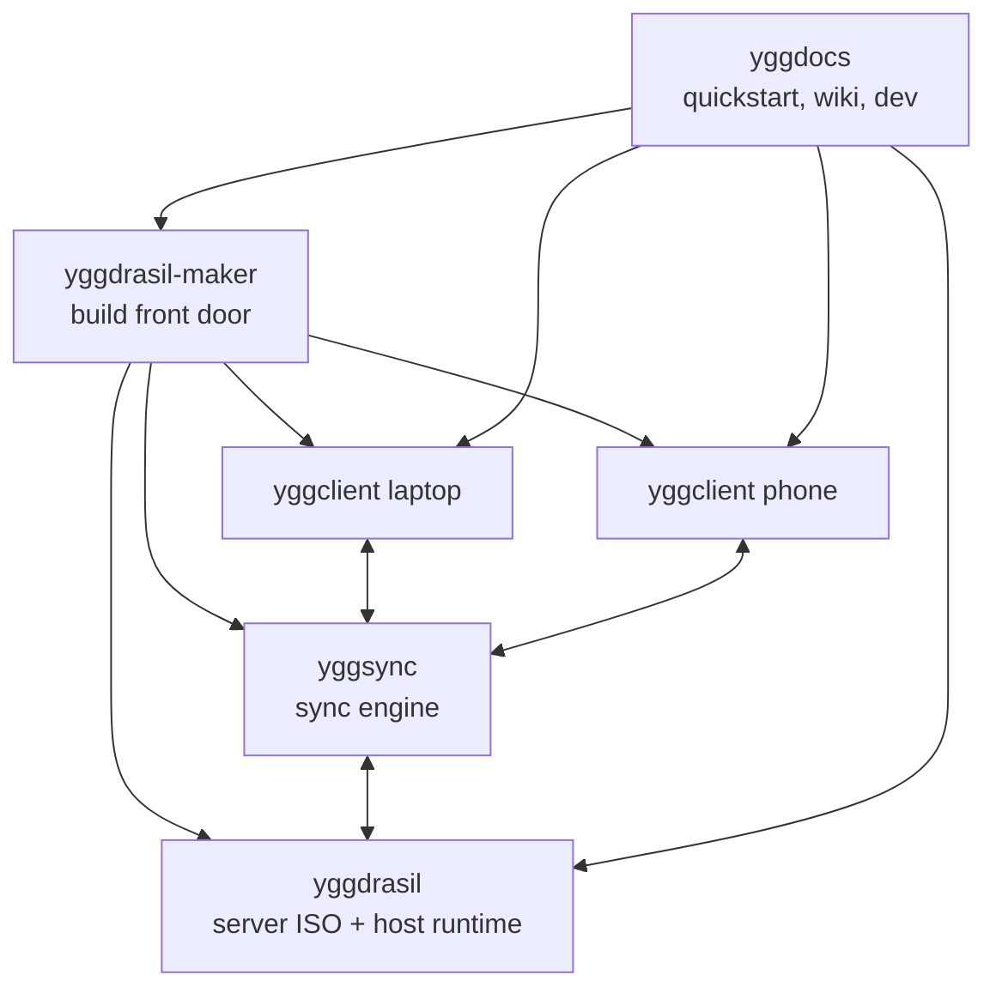

# yggdrasil

`yggdrasil` builds the host at the center of the Yggdrasil ecosystem.

It produces a Debian sid live ISO for the machine that becomes your storage spine, your LXC host, your recovery anchor, and often the quiet box in the corner that the rest of your setup eventually depends on.

This repository carries both halves of that story:

- `mkconfig.sh` is the direct operator path, and the whole build truth
- `yggdrasil-maker` is a front door onto that same path, in the yggterm viewport

The public contract is simple:

- the shell path is the product; the maker is a way in, not a gate
- native config stays real, and nothing is stored in a format only the maker reads
- the maker shows you the command lines it would run, so you can run them yourself
- the app's job ends when your custom ISO is ready and you know how to boot it
- long-form docs still belong in `yggdocs`

## The Ecosystem In One View

A simple mental model:

- `yggdrasil-maker` is the front door that plans and drives the build
- `yggdrasil` contains the native build truth and host runtime wiring
- `yggclient` configures the machines you use every day
- `yggsync` moves data between them
- `yggdocs` is the manual, field guide, and operational memory

```text
                         +----------------------+
                         |       yggdocs        |
                         | quickstart, wiki, dev|
                         +----------+-----------+
                                    |
                                    v
 +-------------+           +--------+--------+           +-------------+
 |  yggclient  |<--------->|    yggsync      |<--------->|  yggclient  |
 |   laptop    |           | sync engine     |           |    phone    |
 +------+------+           +--------+--------+           +------+------+
        \                           |                           /
         \                          |                          /
          \                         v                         /
           +------------------------------------------------+
           |                  yggdrasil                     |
           | Debian sid ISO, ZFS, LXC, host runtime         |
           +-------------------------+----------------------+
                                     ^
                                     |
                              +--------------+
                              |  maker app   |
                              | in the ygg-  |
                              | term viewport|
                              +--------------+
```

Mermaid version:


```mermaid
flowchart TD
  D[yggdocs<br/>quickstart, wiki, dev]
  C[yggdrasil-maker<br/>build front door]
  S[yggdrasil<br/>server ISO + host runtime]
  Y[yggsync<br/>sync engine]
  L[yggclient laptop]
  P[yggclient phone]

  C --> S
  C --> L
  C --> P
  C --> Y
  L <--> Y
  P <--> Y
  Y <--> S
  D --> C
  D --> S
  D --> L
  D --> P
```

## What A Yggdrasil Server Is

A Yggdrasil server is not just a generic Debian install.
It is the machine you prepare to do the heavy, patient work:

- import and mount your ZFS pool correctly
- bring up LXC with the expected defaults
- autostart the containers that matter
- remain bootable and understandable from a USB image
- give you a reproducible host baseline instead of an improvised snowflake

For many operators, this becomes the box that eventually holds:

- storage
- containers
- backup targets
- sync destinations
- reverse proxies
- service front doors

That is why the ISO matters.
It is not wallpaper.
It is the first disciplined step in the rest of the system.

## Who This Repo Is For

Use this repository directly if:

- you are comfortable editing config files
- you want full control over build inputs
- you want to script builds without waiting for the GUI
- you want to understand the host composition plainly

Use `yggdrasil-maker` if:

- you want to see what a build would run before it runs
- you want the checkout's profiles, configs and knobs listed for you
- you are new to the ecosystem and want the shape of it in one view
- you already live in yggterm and would rather not leave it

The important design rule is this:

- the shell path is the truth; the maker never hides it
- the native config files stay real and editable
- the path from beginner to operator stays open

## Repository Boundaries

- `yggdrasil`: ISO composition, hooks, package lists, host runtime wiring
- `yggdrasil-maker`: the build front door, as a libyggterm app in the yggterm viewport
- `yggclient`: endpoint automation for laptops, desktops, and Android/Termux
- `yggsync`: sync engine and job runner
- `yggdocs`: quickstart, wiki, recipes, and developer references

## Local Config

Use a local untracked config file.

- tracked example: `ygg.example.toml`
- tracked template preserving the old infrastructure shape: `ygg.legacy-infra.example.toml`
- local file: `ygg.local.toml` (gitignored)

`mkconfig.sh` accepts `--config` with either:

- TOML (`*.toml`)
- env files containing `YGG_*` key/value pairs

That means a power user can stay here permanently without `yggdrasil-maker`, while a new user can begin with the app and later continue by hand.

## Quick Start

### Front door with `yggdrasil-maker`

`yggdrasil-maker` is a libyggterm app: run it inside a yggterm terminal and it
takes over the viewport; run it anywhere else and it serves the same UI on
loopback and prints the URL.

```bash
cargo build --release --manifest-path yggdrasil-maker/Cargo.toml
./yggdrasil-maker/target/release/yggdrasil-maker
```

It has three flows:

- **Home** lists what this checkout actually contains: the profiles parsed from
  `mkconfig.sh`'s own usage block, every `ygg*.toml` with its knobs, package
  lists, hooks, built ISOs, and whether `lb` is installed
- **Plan** renders exactly what a build would run without running it, including
  the resolved environment and the config delta against `ygg.example.toml`
- **Run** executes the config stage for real and streams the log

The maker is a front door, never a proprietary format trap, and never charged
for. Everything it does, `./mkconfig.sh` also does from a shell — which is why
the Plan flow shows you the command lines rather than hiding them. The image
stages still need root and tens of minutes, and the maker shows them as staged
steps rather than pretending to run them.

Design notes and the full control-flow map: `yggdrasil-maker/docs/adr-0001-libyggterm-app.md`.

### Direct path with `mkconfig.sh`

If you want to work here directly:

```bash
cp ygg.example.toml ygg.local.toml
./mkconfig.sh --config ./ygg.local.toml --profile server
```

To build both server and KDE variants:

```bash
./mkconfig.sh --config ./ygg.local.toml --profile both
```

To skip smoke tests during iteration:

```bash
./mkconfig.sh --config ./ygg.local.toml --profile server --skip-smoke
```

## First Server Guidance

For a first Yggdrasil server, the recommended path is conservative:

1. set the host basics first
2. keep `apt_proxy_mode = "off"`
3. keep `infisical_boot_mode = "disabled"` unless you already run Infisical in an LXC
4. build and boot the host
5. validate ZFS import, LXC defaults, and container behavior
6. add an apt-proxy container later if you actually need faster rebuilds
7. switch later builds to explicit proxy mode
8. switch later builds to `infisical_boot_mode = "container"` only after you intentionally adopt that pattern

That sequence is deliberate.
The first success should be legible.
Speed comes after trust.

Kernel policy:

- `with_lts = false` uses Debian unstable's current kernel line
- `with_lts = true` switches to the compatibility-pinned kernel path
- that compatibility path is useful when a driver or DKMS stack needs a steadier ABI

## Examples

### 1. First server with defaults

```bash
cp ygg.example.toml ygg.local.toml
./mkconfig.sh --config ./ygg.local.toml --profile server
```

Use this when you want to produce the first ISO before tuning every dial.

The public default deliberately does not assume a secrets-management container on day one.
When you later want the boot path to ensure an Infisical LXC is up before dependent services, set:

```toml
infisical_boot_mode = "container"
infisical_container_name = "infisical"
```

Keep private hostnames, container names, proxy addresses, and SSH paths in your local untracked config only.

## Intel Arc SR-IOV Live Host

If you want the live host to expose Intel Arc virtual functions for KVM guests, use the opt-in SR-IOV path documented in:

- `docs/intel-arc-sriov-live-host.md`

By default, `yggdrasil` uses the stock in-kernel `i915` driver.

The SR-IOV path is intentionally opt-in and experimental. It bakes the out-of-tree `i915-sriov-dkms` driver into the ISO, adds the required kernel arguments, provisions VFs at boot, and can bind those VFs to `vfio-pci` for guest assignment.

Use the stock in-kernel `i915` path unless you are explicitly experimenting with Intel GPU SR-IOV or other unsupported Intel graphics virtualization work.

### 2. Automated server build with explicit overrides

```bash
yggcli --workspace ~/gh \
  --set yggdrasil.hostname=mewmew \
  --set yggdrasil.net_mode=dhcp \
  --set yggdrasil.static_dns="192.168.1.1 9.11.11.11" \
  --set yggdrasil.with_lts=false \
  --set yggdrasil.with_nvidia=false \
  --build-iso --profile server
```

Use this when a CI job, agent, or repeatable script is driving the build.

### 3. Direct build from a local TOML profile

```bash
./mkconfig.sh --config ./ygg.local.toml --profile server
./mkconfig.sh --config ./ygg.local.toml --profile kde
```

Use this when you want the server and desktop ISOs to stay separate and explicit.

## What The Build Produces

The normal output is a bootable live ISO that carries the host runtime choices baked into this repository:

- Debian sid userspace
- current Debian kernel line
- ZFS userspace and DKMS integration
- LXC defaults and autostart hooks
- optional KDE profile when requested
- optional SSH key embedding when configured

## Backup Legs

The host's data has two independent backup legs — the stick is the one that
survives losing the machine:

1. **Leg 1 — live replication:** daily incremental ZFS replication of the
   irreplaceable datasets onto a second pool on the same machine
   (`jewel-backup`).
2. **Leg 2 — the recovery stick:** `scripts/data-snapshot-export.sh`
   exports each protected dataset's newest backup snapshot as standalone
   ZFS stream files into a spool; the Ventoy stick carries the ISO **and**
   the spool, so a rebuilt host restores its data with `zfs recv` — no
   network, no second pool.

Site values (dataset list, spool, stick mount) live in
`/etc/yggdrasil/data-export.conf`, generated locally, never committed.
Full mechanics and the restore procedure:
`docs/data-snapshot-export.md`.

## Privacy And Public Hygiene

Do not commit:

- private hosts
- internal domains
- tokens
- secrets
- local-only infrastructure names

Use generalized examples in tracked files.
Keep your real values in `ygg.local.toml` and other gitignored local config files.

## Where To Read Next

- `yggdocs` for the real quickstart and recipes
- `yggcli` if you want the guided path
- `AGENTS.md` if you are working on build and ops automation in this repo

## License

- Code: **GPL-3.0-or-later**, full text in `LICENSE`
- Documentation: **CC BY-SA 4.0**, see `LICENSE-CC-BY-SA-4.0`
- Names and logos: neither licence covers them — see `TRADEMARKS.md`

Copyright 2026 Avikalpa Kundu <avi@gour.top>.

Yggdrasil was Apache-2.0 until 2026-08-01. Anything published under that licence
stays available under it; everything from the relicensing commit onward is
GPL-3.0-or-later.

This licence covers *this repository* — the build configuration, scripts, and
docs. An image built from it also contains Debian packages and other upstream
software, each of which keeps its own licence and carries it into the image.

Contributions need a signed CLA, because this project is also licensed
commercially. See `CONTRIBUTING.md` and `CLA.md` — it is a page, you keep your
copyright, and it takes one line to sign.
